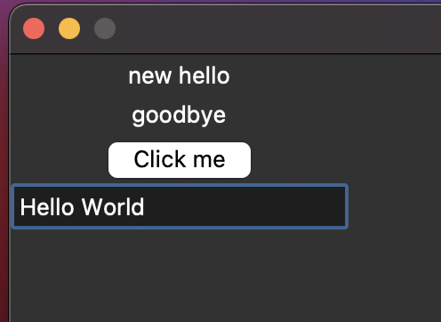

# Chapter 13: Python and Graphical User Interfaces

We are using tkinter for the GUI

```
from tkinter import *
```

If this gives an error then do the following because TK needs to be installed on your machine
```
brew install python-tk
```

Very small example of a program

```
# import tkinter
from tkinter import *

# create a window
root = Tk()

# create a label
hello = Label(root, text='hello')

# display the label in the window
hello.grid(row=0,column=0)

# another one
goodbye = Label(root, text='goodbye')
goodbye.grid(row=1, column=0)

# create a function
def been_clicked():
    print('click')

# create a button and place it on the second row   
btn = Button(root, text='Click me', command=been_clicked)    
btn.grid(row=2, column=0)

# have a box to enter things. user input
ent = Entry(root)
ent.grid(row=3,column=0)

# get the text from the user input
print(ent.get())

# Don't be able to change the size of the box
root.resizable(width=False, height=False)
```

    

to make sure your program does not flash up and close use the following in your program

```
root.mainloop()
```

# Messageboxes
```
from tkinter import messagebox
```

# Drawing application

```
# drawing application
from tkinter import *
root = Tk()

# create the drawing field
c = Canvas(root, width=500, height=500)

# display it
c.grid(row=0, column=0)

# function for the mouse
def mouse_move(event):
    print(event.x,event.y)

# mouse movement    
c.bind('<B1-Motion>', mouse_move)

# create a blue line
c.create_rectangle(100,100,300,200,outline='blue',fill='blue')

# remove the blue line
c.delete(1)

# store the mouse butten you draw
def mouse_move_draw(event):
    c.create_rectangle(event.x-5,event.y-5,event.x+5,event.y+5,fill='red', outline='red')
    
# execute it
c.bind('<B1-Motion>', mouse_move_draw)
```

# list a box
```
# drawing application
from tkinter import *
root = Tk()

# create a listbox object
lb = Listbox(root)
lb.grid(row=0, column=0)

# insert the first list
lb.insert(0, 'hello')

# list some extra items
lb.insert(1,'goodbye')
lb.insert(0,'top line')
lb.insert(END, 'bottom line')
```